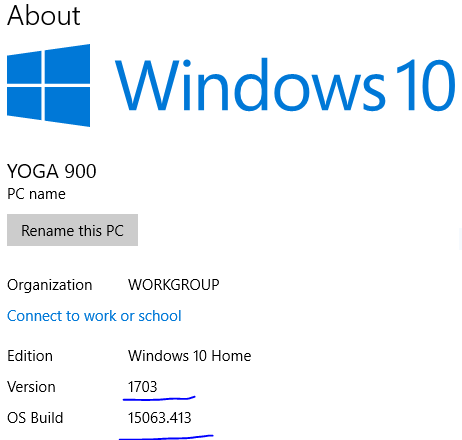
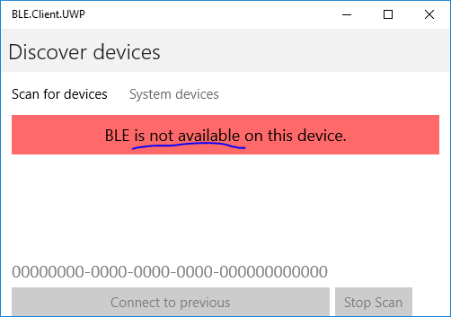

## BLE.Client.UWP

This is a very early version:

UWP app runs with the framework, Bluetooth is always _not available_.

### Windows 10 Version 1703

 In Windows 10 version 1703 (updated 2017 March), also known as the Creators Update, [`bluetoothledevice.getgattservicesasync` is added](https://docs.microsoft.com/en-us/windows/uwp/whats-new/windows-10-version-1703-api-diff), so the binding ceremony is not mandatory anymore. 
 
 The code is based on that version, please check your Windows 10 version.
 
 
 
```     
<TargetPlatformVersion>10.0.15063.0</TargetPlatformVersion>
<TargetPlatformMinVersion>10.0.15063.0</TargetPlatformMinVersion>
```


### Technologies
1. MvvmCross 5

This is why this branch is not PR to original repo yet. I tried MvvmCross 4.4, but I just can't get it work with Xamarin.Forms on UWP

2. Xamarin.Froms

UI part for UWP. 
It's also shared from Android/iOS projects. See the screenshot.

### Screenshot




